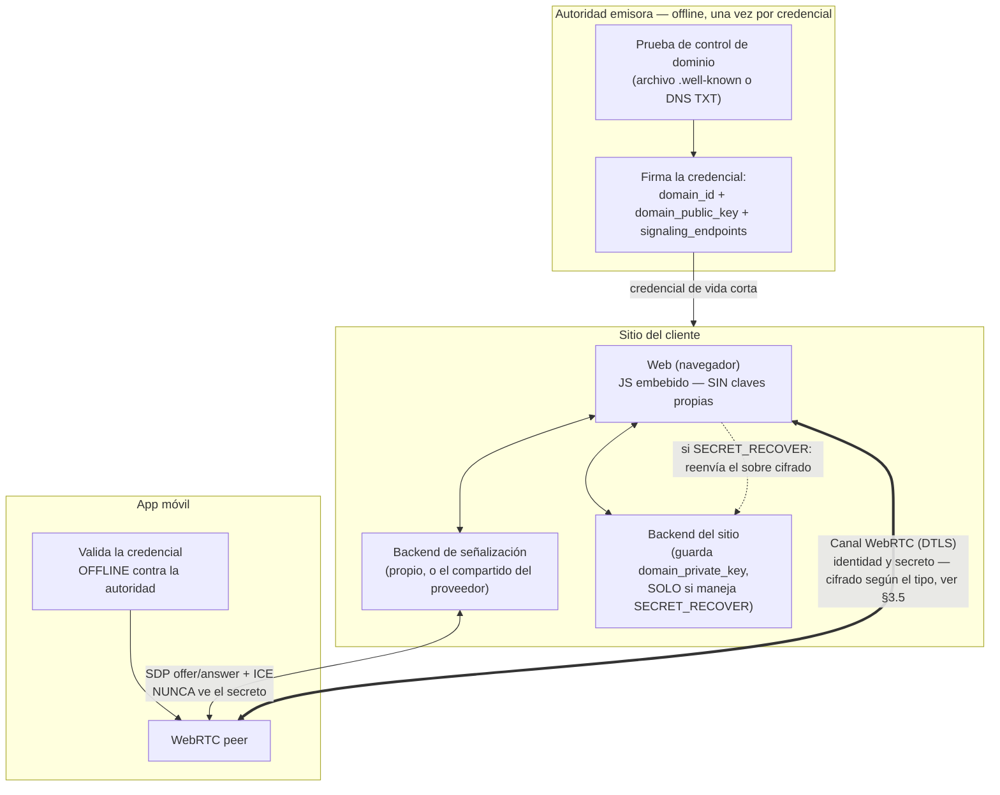
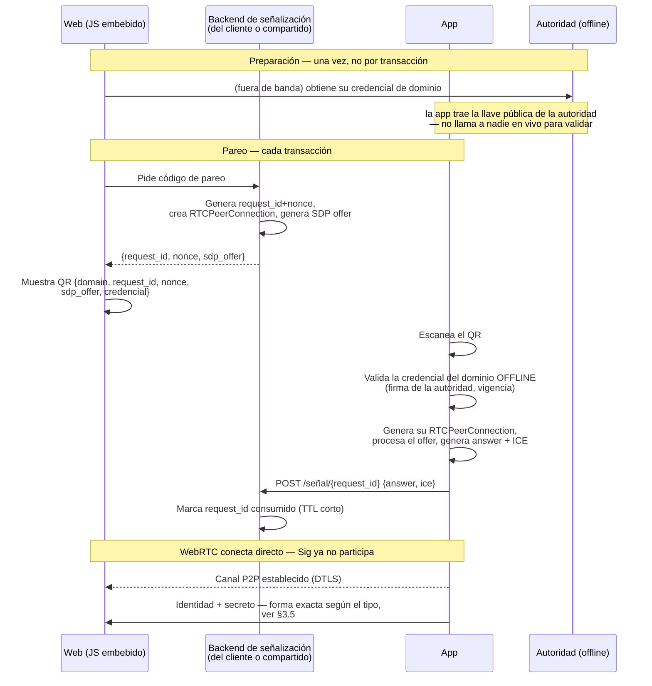

# Arquitectura v2 (visión objetivo) — sin backend centralizado

> **Estado: conceptual, no implementado.** Este documento no describe
> código existente — describe una dirección de diseño discutida para
> resolver una limitación real de `diseno_app.md` (v0.1) y de la
> implementación actual (ver `PROTOCOLO_REAL.md`): en ambos, "el
> Dominio" termina siendo un backend en vivo que la app tiene que
> consultar para verificar identidad, lo cual — si un operador ofrece
> esto como servicio a varios clientes — lo convierte en un tercero de
> confianza centralizado, algo que se quiere evitar.

## 0. El problema que resuelve

En `diseno_app.md` y en el código real, "Dominio" (`server/servidor.mjs`)
hace tres cosas a la vez:

1. **Afirma quién es** (identidad) — `domain_id`, `domain_public_key`.
2. **Verifica en vivo** cada `request_id` (`GET /verificar/:id`).
3. **Ejecuta criptografía en el momento** — descifra lo que la app
   devuelve, firma/valida.

Si un mismo operador corre ese backend para varios clientes distintos
(el patrón "solo instala un JavaScript"), ese operador termina siendo
quien decide, en cada transacción, si un dominio es válido — es decir,
se vuelve el tercero de confianza real del sistema, aunque el diseño
original no lo llame así.

La idea de esta v2 es separar esas tres funciones y dejar solo una con
carácter de "servicio en vivo" — y esa, además, sin capacidad de leer
ni transportar el secreto.

---

## 1. Separar identidad de disponibilidad

No todo lo que hoy hace "verificar el dominio" necesita un servidor
respondiendo en tiempo real:

| Necesidad | ¿Requiere algo vivo? |
|---|---|
| Afirmar `domain_id` + `domain_public_key` | No — puede ser una credencial estática, verificable offline |
| Consumir un `request_id` una sola vez | Sí — pero es estado mínimo, de vida cortísima |
| Descifrar/firmar en el momento del pareo o la devolución | Depende del tipo de operación — ver §3.5 |

---

## 2. La credencial de dominio

Reemplaza el `GET /verificar/:id` de hoy. Se emite **una vez** (y se
renueva periódicamente), no en cada transacción.

```
Credencial {
  domain: "clientea.com"
  domain_id: "..."
  domain_public_key: "..."          // usada en §10: dominio → app
  signaling_endpoints: [
    "https://senalizacion.tuservicio.com",   // compartido, opcional
    "https://backup.clientea.com"            // propio del cliente, opcional
  ]
  issued_at, expires_at   // vida corta — renovación > lista de revocación
  issuer_signature        // firmada por la autoridad emisora
}
```

**Emisión:** la autoridad (operada por el proveedor del protocolo, no
por cada cliente) prueba que quien la pide controla de verdad ese
dominio, con el mismo mecanismo que usa cualquier CA tipo ACME/Let's
Encrypt — un archivo en `.well-known/` o un registro DNS TXT. Es la
única vez que interviene un tercero en todo el flujo, y no vuelve a
participar después.

**Verificación:** la app valida la firma de la credencial contra la
llave pública de la autoridad — **offline, sin llamar a nadie**. Si la
credencial expiró, dejó de servir por sí sola: no hace falta una lista
de revocación activa.

**Nota abierta:** si se adopta HPKE para `SECRET_RECOVER` (ver §3.5),
la credencial necesitaría una segunda llave pública
(`domain_public_key_recover`, X25519) distinta de la RSA que usa §10 —
son primitivas distintas para direcciones distintas del protocolo. No
es una complicación grave, pero hay que decidirlo antes de fijar el
formato final de la credencial.

---

## 3. Pareo y transporte: WebRTC con señalización desacoplable

La única pieza que sigue necesitando algo "vivo" para el **pareo en
sí** es el intercambio inicial de SDP/ICE — y ese intercambio **nunca
ve el secreto ni ninguna clave privada**, solo dos mensajes cortos de
señalización.

`signaling_endpoints` en la credencial le dice a la app a dónde mandar
esos mensajes — puede ser el servicio del proveedor, el backend propio
del cliente, o ambos.

Una vez abierto el canal WebRTC, identidad y secreto viajan **directo
entre la App y el sitio** — pero el sitio, aquí, no es "la Web" en el
sentido del navegador. Hay que separar dos cosas que antes se
mezclaban en una sola caja:

- **Web (navegador)** — el JavaScript embebido. No tiene ninguna clave
  propia; no puede tenerla de forma segura (cualquier clave en el
  navegador es visible a XSS, sin protección de hardware). Solo
  muestra el QR y participa del `DataChannel` para lo que no requiera
  una clave privada.
- **Backend del sitio** — el servicio (propio del cliente, o el que
  ofrezca el proveedor) que sí guarda la clave privada del dominio,
  cuando esa clave hace falta (ver §3.5 — solo aplica a
  `SECRET_RECOVER`, no a todo el protocolo).



### Pareo, paso a paso



---

## 3.5. Dos tipos de operación sobre el secreto

Esta es una distinción que no estaba en las versiones anteriores de
este documento, y cambia quién necesita qué clave. `purpose` se
extiende a tres valores:

```
PAIR             → emparejamiento inicial (sin cambios de fondo)
SECRET_VERIFY    → el dominio YA sabe el secreto; solo confirma que
                    la app todavía lo tiene
SECRET_RECOVER   → el dominio NO tiene el valor; necesita recibirlo
                    de verdad
```

### `SECRET_VERIFY` — no necesita cifrado de aplicación

El dominio generó el secreto al emparejar y lo guardó — cuando pide
verificación, no está *recibiendo* información nueva, está
*comparando*. Por eso a la app le basta con enviar una prueba, no el
valor:

```json
{
  "request_id": "...", "nonce": "...", "domain_id": "...",
  "app_id": "...",
  "secret_fingerprint": "SHA256(secreto)",
  "signature": "..."
}
```

Este mensaje puede viajar **sin cifrar** — un hash SHA-256 de un valor
con ~192 bits de entropía no es invertible ni adivinable, y la firma
tampoco expone nada. El backend del sitio no necesita ninguna clave
privada para este camino: solo compara `SHA256(lo que él guardó)`
contra el `secret_fingerprint` recibido, con `timingSafeEqual` (igual
que hace hoy `iguales()` en `servidor.mjs`).

**Lo único que se filtra si este mensaje pasara por un tercero es
metadata** (qué app habló con qué dominio, cuándo) — no el secreto.
Por disciplina de arquitectura, este mensaje debe viajar solo por el
`DataChannel` directo, nunca por el backend de señalización.

### `SECRET_RECOVER` — sí necesita cifrado real, y por tanto una clave privada

Aquí el dominio no tiene el valor de antemano (por ejemplo, una clave
de recuperación derivada en el dispositivo). Un hash no sirve para
nada — hace falta el valor en sí, y como viaja por una red que no se
controla, tiene que llegar cifrado para la clave pública del dominio:

```json
{
  "envelope": { "alg": "...", "encrypted_key": "...", "iv": "...",
                "ciphertext": "...", "tag": "..." },
  "signature": "..."
}
```

El **backend del sitio** (no el navegador, no el backend de
señalización) descifra esto con su clave privada de dominio.

**Primitiva recomendada: HPKE (RFC 9180), modo base, `DHKEM(X25519,
HKDF-SHA256) + HKDF-SHA256 + AES-256-GCM`.** Dos razones, no solo una:

1. **Forward secrecy** — cada cifrado usa un par de claves efímero,
   descartado después de usarse. Si la clave privada del dominio se
   compromete más adelante, no sirve para abrir sobres pasados.
2. **Cifrar con HPKE en modo base es software puro** — la app genera
   el par efímero y cifra sin tocar el Keystore/TEE para nada. Esto
   importa especialmente por lo que se documenta en §7: evita
   depender de un hardware de firma/cifrado que varía (y falla de
   formas distintas) entre fabricantes.

Alternativa más simple, sin dependencia nueva: seguir con RSA-OAEP
como hoy, para esta dirección — funciona, ya está diagnosticado en
software puro (no hay Keystore de por medio en el lado que *cifra*,
solo en el lado que *descifra*, si algún día quisiéramos moverlo al
teléfono). **Esta decisión sigue abierta** — no hace falta cerrarla
para avanzar en el resto del plan.

### Dónde vive la clave privada de recuperación

Solo hace falta para `SECRET_RECOVER` — `SECRET_VERIFY` no la
necesita en absoluto, y ese es probablemente el camino más frecuente
en la mayoría de los negocios.

- **Punto de partida:** variable de entorno (`.env`) en el proceso del
  backend del sitio — mismo nivel de protección que ya tiene
  `dominio.pem` hoy (0600, fuera de `public_html`).
- **Evolución natural, sin cambiar el protocolo:** mover esa clave a
  un KMS/vault (AWS KMS, HashiCorp Vault, Google Cloud KMS). La
  credencial solo conoce la llave *pública* — cómo se custodia la
  privada es un detalle interno del backend del sitio, invisible para
  la app y para la autoridad emisora.
- Como `SECRET_RECOVER` es (se espera) poco frecuente, esta clave
  puede incluso quedar detrás de un paso de aprobación más deliberado
  (operador humano, doble control) sin afectar la experiencia de
  `SECRET_VERIFY`, que sigue siendo instantáneo y sin ninguna clave
  privada de por medio.

---

## 4. Un solo uso / anti-replay sin backend de verificación

El consumo atómico del `request_id` ya no lo hace un "verify" en vivo
del dominio — lo hace el propio backend de señalización, como efecto
colateral de procesar la respuesta SDP. Es el único estado que
necesita guardar, y por minutos, no de forma permanente. Aplica igual
para los tres valores de `purpose`.

---

## 5. Disponibilidad, en dos capas distintas

- **Interna (invisible al protocolo):** el operador de un
  `signaling_endpoint` resuelve su propia alta disponibilidad con las
  herramientas normales — balanceador, varias instancias, health
  checks.
- **Externa (explícita en la credencial):** `signaling_endpoints`
  puede traer más de un valor, de **operadores distintos**, como
  respaldo cross-operador para el escenario catastrófico en que un
  servicio entero deja de responder.

---

## 6. Modelo de negocio que se desprende

| Pieza | ¿Quién la opera? | ¿Toca el secreto? |
|---|---|---|
| Autoridad emisora de credenciales | Siempre el proveedor | No — solo certifica dominios, una vez |
| Backend de señalización | El proveedor (compartido) **o** el propio cliente | No — solo pasa SDP/ICE |
| Backend del sitio (clave de recuperación) | Siempre el propio cliente | Solo para `SECRET_RECOVER`; nunca lo transporta un tercero |
| Canal WebRTC (identidad + secreto) | Nadie — directo entre App y el sitio | Sí, cifrado según el tipo (§3.5) |

El único punto fijo e irremplazable es la autoridad emisora.

---

## 7. Compatibilidad multi-dispositivo

**El problema:** todo lo que `SigningModule.kt` "sabe" hoy sobre qué
combinación de Keystore funciona —StrongBox rompe el descifrado
RSA-OAEP, la autenticación biométrica también, MGF1 solo admite
SHA-1— viene de **un solo dispositivo de referencia** (Samsung
SM-T545). La política actual (nunca StrongBox, nunca autenticación
para esa clave) es una regla global inferida de una muestra de tamaño
uno. Otros fabricantes —Google Pixel (Titan M), Qualcomm, MediaTek—
tienen implementaciones de Keymaster/KeyMint distintas, con bugs
propios que no tienen por qué parecerse a los de Samsung.

**Esto le importa solo a la dirección §10** (la app descifrando lo que
el dominio le entrega al emparejar) y, si algún día se decide mover el
descifrado de `SECRET_RECOVER` al teléfono, también a esa. **No le
importa** al cifrado en modo efímero de HPKE del lado que *emite*
(§3.5), porque esa operación es software puro y no toca el Keystore en
ningún fabricante.

**Qué cambiar:**

1. **Diagnóstico en el primer arranque, no como herramienta de debug
   manual.** El código ya tiene `diagnosticarOaep()` y
   `autoconsistenciaCifrado()` — hoy solo se disparan cuando algo
   falla, para investigar después. Deberían correr **dentro de
   `crearIdentidad()`**, antes de generar la clave real, probando en
   ese dispositivo concreto: RSA-OAEP en TEE sin autenticación, en TEE
   con autenticación, y en StrongBox si el equipo lo tiene — y generar
   la clave real con la combinación que de verdad funcionó ahí, no la
   que funcionó en el dispositivo de referencia.
2. **Guardar el resultado por dispositivo.** Ya existe el patrón
   (`strongBox: boolean` se guarda tras crear identidad) — hay que
   ampliarlo para registrar también si la clave RSA quedó con o sin
   autenticación, y qué combinación de MGF1 funcionó, en vez de
   asumirlo fijo para todos los equipos.
3. **Matriz de dispositivos antes de considerar esto listo para
   producción amplia** — al menos un representante de cada familia
   de chip común:
   - Google Pixel (Titan M)
   - Samsung (Knox) — ya se tiene
   - Un Qualcomm genérico (Motorola, Xiaomi gama media-alta)
   - Un MediaTek (gama baja/media — relevante para LatAm)

   Los emuladores de Android Studio **no reproducen estos bugs** — el
   Keymaster de software del emulador no tiene los defectos de
   hardware real; hace falta hardware físico para esta prueba.
4. **Plan B explícito si ninguna combinación funciona en un equipo
   nuevo.** Hoy un fallo distinto produce un error genérico
   (`E_DESCIFRADO`) sin indicar la causa real. Con el diagnóstico
   corriendo al crear identidad, se puede detectar temprano y decidir:
   degradar a la combinación más permisiva conocida, o directamente
   informar al usuario que ese dispositivo no es compatible — en vez
   de que falle silenciosamente en medio de un emparejamiento real.

---

## 8. Qué cambia frente a lo que existe hoy (`PROTOCOLO_REAL.md`)

| | Hoy (implementación real) | v2 (objetivo) |
|---|---|---|
| Verificación de identidad del dominio | `GET /verificar/:id` en vivo | Credencial firmada, validada offline |
| Transporte del secreto | HTTP directo (WebRTC nunca se implementó) | WebRTC real, P2P entre App y sitio |
| Rol del "Dominio" | Backend centralizado: identidad + estado + cripto, todo junto | Autoridad (offline) + señalización (mínima) + backend del sitio (cripto, solo si aplica) |
| Tipos de operación sobre el secreto | Uno solo (`SECRET_REQUEST`), siempre con sobre cifrado | Dos (`SECRET_VERIFY` sin cifrado, `SECRET_RECOVER` con cifrado real) |
| Quién necesita la clave privada del dominio | Siempre, para cualquier devolución de secreto | Solo para `SECRET_RECOVER` — y ese uso puede quedar detrás de más fricción deliberada |
| Compatibilidad de hardware | Política fija, inferida de un solo dispositivo | Diagnóstico por dispositivo en el primer arranque |
| Multi-tenant | Una clave RSA por proceso — clientes comparten `domain_id` | Cada cliente tiene su propia credencial e identidad |
| Disponibilidad | Un solo proceso PM2 | Balanceo interno + fallback cross-operador |

---

## 9. Preguntas abiertas — pendientes de decidir

1. **Formato exacto de la credencial** — ¿JWT firmado, CBOR, algo tipo
   X.509 minimalista?
2. **Vida útil y renovación de la credencial** — ¿cada cuánto expira?
   ¿renovación automática o manual?
3. **Primer arranque sin conectividad** — ¿la llave pública de la
   autoridad viene embebida en el binario, o se descarga y se cachea?
4. **HPKE vs. RSA-OAEP para `SECRET_RECOVER`** — HPKE da forward
   secrecy y evita el Keystore, pero es una dependencia nueva
   (`hpke-js`, Tink); RSA-OAEP es lo que ya se conoce. No urgente de
   cerrar.
5. **Diseño concreto del backend de señalización mínimo** — candidato:
   función serverless + almacén con TTL corto (Redis o equivalente).
6. **TURN** — ¿quién lo opera para redes que no logran P2P puro?
7. **Migración** — cómo pasar de `server/servidor.mjs` (hoy, un
   backend por proceso) a este modelo sin romper lo ya desplegado en
   `fileserver.locker/localvault/`.
8. **Matriz de dispositivos (§7)** — pendiente de ejecutar antes de
   considerar el flujo `SECRET_RECOVER`/§10 listo para producción
   amplia.

---

## 10. Relación con los otros documentos del repo

- **`diseno_app.md`** — la especificación v0.1 original. Pide WebRTC,
  un único "Dominio" que hace de todo, y no distingue tipos de
  operación sobre el secreto.
- **`PROTOCOLO_REAL.md`** — lo que el código hace hoy: HTTP en vez de
  WebRTC, un backend por proceso, un solo tipo de devolución de
  secreto (siempre cifrado), sin credenciales.
- **Este documento** — hacia dónde podría evolucionar el protocolo:
  identidad por credencial offline, transporte por WebRTC con
  señalización desacoplable, dos tipos de operación sobre el secreto
  según si el dominio necesita o no recibir algo nuevo, y
  compatibilidad de hardware diagnosticada por dispositivo en vez de
  asumida de forma global.
