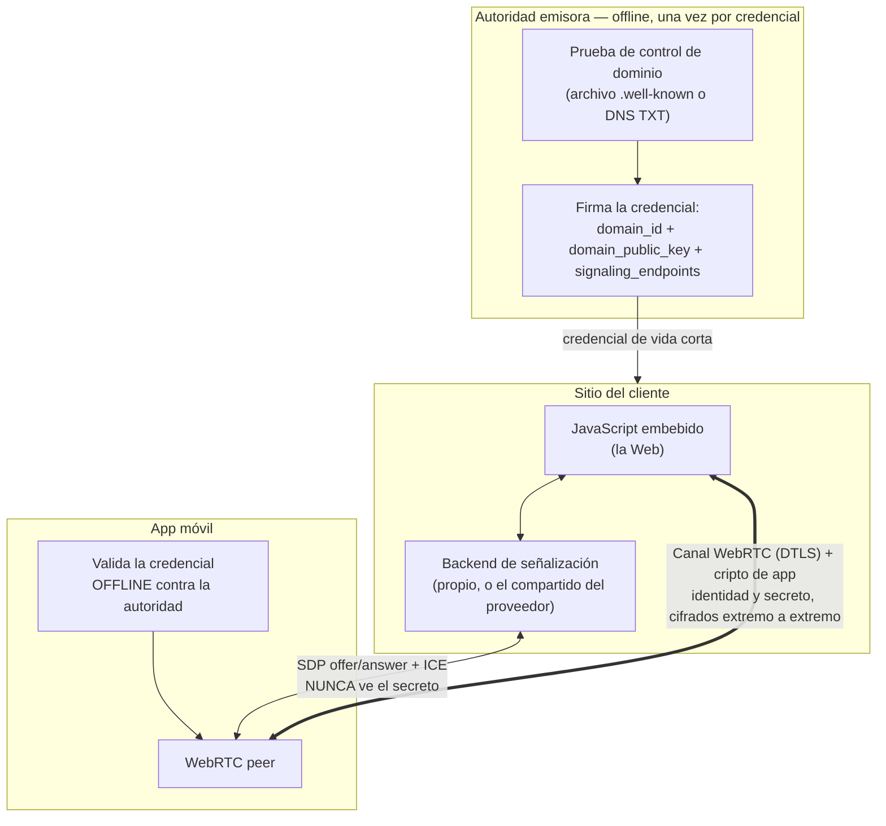
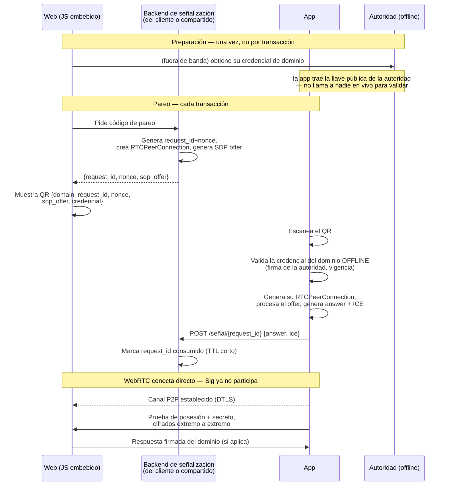

# Arquitectura v2 (visión objetivo) — sin backend centralizado

> **Estado: conceptual, no implementado.** Este documento no describe
> código existente — describe una dirección de diseño discutida para
> resolver una limitación real de `diseno_app.md` (v0.1) y de la
> implementación actual (ver `PROTOCOLO_REAL.md`): en ambos, "el
> Dominio" termina siendo un backend en vivo que la app tiene que
> consultar para verificar identidad, lo cual — si un operador ofrece
> esto como servicio a varios clientes — lo convierte en un tercero de
> confianza centralizado, algo que se quiere evitar.

## 0. El problema que resuelve

En `diseno_app.md` y en el código real, "Dominio" (`server/servidor.mjs`)
hace tres cosas a la vez:

1. **Afirma quién es** (identidad) — `domain_id`, `domain_public_key`.
2. **Verifica en vivo** cada `request_id` (`GET /verificar/:id`).
3. **Ejecuta criptografía en el momento** — descifra lo que la app
   devuelve, firma/valida.

Si un mismo operador corre ese backend para varios clientes distintos
(el patrón "solo instala un JavaScript"), ese operador termina siendo
quien decide, en cada transacción, si un dominio es válido — es decir,
se vuelve el tercero de confianza real del sistema, aunque el diseño
original no lo llame así.

La idea de esta v2 es separar esas tres funciones y dejar solo una con
carácter de "servicio en vivo" — y esa, además, sin capacidad de leer
ni transportar el secreto.

---

## 1. Separar identidad de disponibilidad

No todo lo que hoy hace "verificar el dominio" necesita un servidor
respondiendo en tiempo real:

| Necesidad | ¿Requiere algo vivo? |
|---|---|
| Afirmar `domain_id` + `domain_public_key` | No — puede ser una credencial estática, verificable offline |
| Consumir un `request_id` una sola vez | Sí — pero es estado mínimo, de vida cortísima |
| Descifrar/firmar en el momento del pareo o la devolución | Sí — pero ya no necesita ser el mismo backend que "verifica"; puede ocurrir directo entre App y sitio, sobre un canal ya establecido |

---

## 2. La credencial de dominio

Reemplaza el `GET /verificar/:id` de hoy. Se emite **una vez** (y se
renueva periódicamente), no en cada transacción.

```
Credencial {
  domain: "clientea.com"
  domain_id: "..."
  domain_public_key: "..."
  signaling_endpoints: [
    "https://senalizacion.tuservicio.com",   // compartido, opcional
    "https://backup.clientea.com"            // propio del cliente, opcional
  ]
  issued_at, expires_at   // vida corta — renovación > lista de revocación
  issuer_signature        // firmada por la autoridad emisora
}
```

**Emisión:** la autoridad (operada por el proveedor del protocolo, no
por cada cliente) prueba que quien la pide controla de verdad ese
dominio, con el mismo mecanismo que usa cualquier CA tipo ACME/Let's
Encrypt — un archivo en `.well-known/` o un registro DNS TXT. Es la
única vez que interviene un tercero en todo el flujo, y no vuelve a
participar después.

**Verificación:** la app valida la firma de la credencial contra la
llave pública de la autoridad — **offline, sin llamar a nadie**. Si la
credencial expiró, dejó de servir por sí sola: no hace falta una lista
de revocación activa.

---

## 3. Pareo y transporte: WebRTC con señalización desacoplable

La única pieza que sigue necesitando algo "vivo" es el intercambio
inicial de SDP/ICE para establecer el canal WebRTC — y ese intercambio
**nunca ve el secreto ni ninguna clave privada**, solo dos mensajes
cortos de señalización.

`signaling_endpoints` en la credencial le dice a la app a dónde mandar
esos mensajes — puede ser:

- el servicio de señalización del propio proveedor (para el cliente que
  solo quiere pegar un script y no operar nada), o
- el backend propio del cliente (para quien no quiere depender de la
  disponibilidad de nadie más), o
- ambos, con el segundo como respaldo del primero.

Una vez abierto el canal WebRTC, identidad (prueba de posesión) y
secreto viajan **directo entre la App y el sitio**, con doble capa de
cifrado: DTLS (WebRTC) + la criptografía de aplicación que ya existe
hoy (RSA-OAEP + AES-256-GCM, firmas ECDSA). El backend de señalización
queda completamente fuera del camino del dato.



### Pareo, paso a paso



---

## 4. Un solo uso / anti-replay sin backend de verificación

El consumo atómico del `request_id` ya no lo hace un "verify" en vivo
del dominio — lo hace el propio backend de señalización, como efecto
colateral de procesar la respuesta SDP. Es el único estado que necesita
guardar, y por minutos, no de forma permanente.

---

## 5. Disponibilidad, en dos capas distintas

- **Interna (invisible al protocolo):** el operador de un
  `signaling_endpoint` resuelve su propia alta disponibilidad con las
  herramientas normales — balanceador, varias instancias, health
  checks. La credencial no sabe ni le importa cuántas instancias hay
  detrás de esa URL.
- **Externa (explícita en la credencial):** `signaling_endpoints` puede
  traer más de un valor, de **operadores distintos**, como respaldo
  cross-operador para el escenario catastrófico en que un servicio
  entero deja de responder — no para fallas normales, que ya absorbe la
  capa interna.

---

## 6. Modelo de negocio que se desprende

| Pieza | ¿Quién la opera? | ¿Toca el secreto? |
|---|---|---|
| Autoridad emisora de credenciales | Siempre el proveedor — es la única pieza verdaderamente centralizada | No — solo certifica dominios, una vez |
| Backend de señalización | El proveedor (servicio compartido, pensado para clientes pequeños/volumen bajo) **o** el propio cliente (control total, sin dependencia de uptime ajeno) | No — solo pasa SDP/ICE |
| Canal WebRTC (identidad + secreto) | Nadie — es directo entre App y el sitio | Sí, pero cifrado extremo a extremo |

El único punto fijo e irremplazable es la autoridad emisora — y es,
de las tres piezas, la que menos fricción de confianza genera: no está
en el camino de ningún dato en vivo, y su trabajo (certificar control
de dominio) es auditable de la misma forma que ya lo es el de una CA.

---

## 7. Qué cambia frente a lo que existe hoy (`PROTOCOLO_REAL.md`)

| | Hoy (implementación real) | v2 (objetivo) |
|---|---|---|
| Verificación de identidad del dominio | `GET /verificar/:id` en vivo, contra un backend por proceso | Credencial firmada, validada offline |
| Transporte del secreto | HTTP directo con el backend (WebRTC nunca se implementó) | WebRTC real, P2P entre App y sitio |
| Rol del "Dominio" | Backend centralizado: identidad + estado + cripto en vivo, todo junto | Tres roles separados: autoridad (offline), señalización (mínima, sin secretos), cripto (directa entre App y sitio) |
| Multi-tenant | Una clave RSA por proceso — varios clientes en el mismo backend comparten `domain_id` | Cada cliente tiene su propia credencial e identidad, sin importar quién opera la señalización |
| Disponibilidad | Un solo proceso PM2, un solo punto de falla | Balanceo interno + fallback cross-operador en la credencial |

---

## 8. Preguntas abiertas — pendientes de decidir

1. **Formato exacto de la credencial** — ¿JWT firmado, CBOR, algo tipo
   X.509 minimalista? Afecta tamaño del QR y facilidad de validar en
   Kotlin/JS.
2. **Vida útil y renovación** — ¿cada cuánto expira? ¿renovación
   automática por el backend del cliente, o manual?
3. **Primer arranque sin conectividad** — si la app necesita la llave
   pública de la autoridad para validar la credencial, ¿viene embebida
   en el binario de la app, o se descarga la primera vez y se cachea?
4. **Diseño concreto del backend de señalización mínimo** — candidato
   razonable: función serverless + almacén con TTL corto (Redis o
   equivalente), sin base de datos persistente.
5. **TURN** — para redes que no logran conectar P2P puro, ¿quién lo
   opera? No es una decisión de confianza (el tráfico sigue cifrado),
   pero sí de costo/infraestructura — ¿se referencia también desde la
   credencial?
6. **Migración** — cómo pasar de `server/servidor.mjs` (hoy, un
   backend por proceso) a este modelo sin romper lo ya desplegado en
   `fileserver.locker/localvault/`.

---

## 9. Relación con los otros documentos del repo

- **`diseno_app.md`** — la especificación v0.1 original. Pide WebRTC,
  pero no contempla credenciales offline ni backend de señalización
  desacoplable: sigue asumiendo un único "Dominio" que hace de todo.
- **`PROTOCOLO_REAL.md`** — lo que el código hace hoy: HTTP en vez de
  WebRTC, un backend por proceso, sin credenciales.
- **Este documento** — hacia dónde podría evolucionar el protocolo para
  eliminar la centralización de confianza sin perder la simplicidad de
  instalación ("pega un script") que se busca ofrecer a los clientes.
