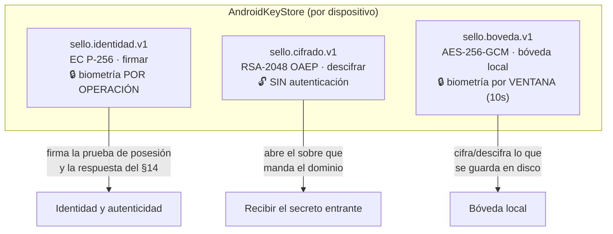
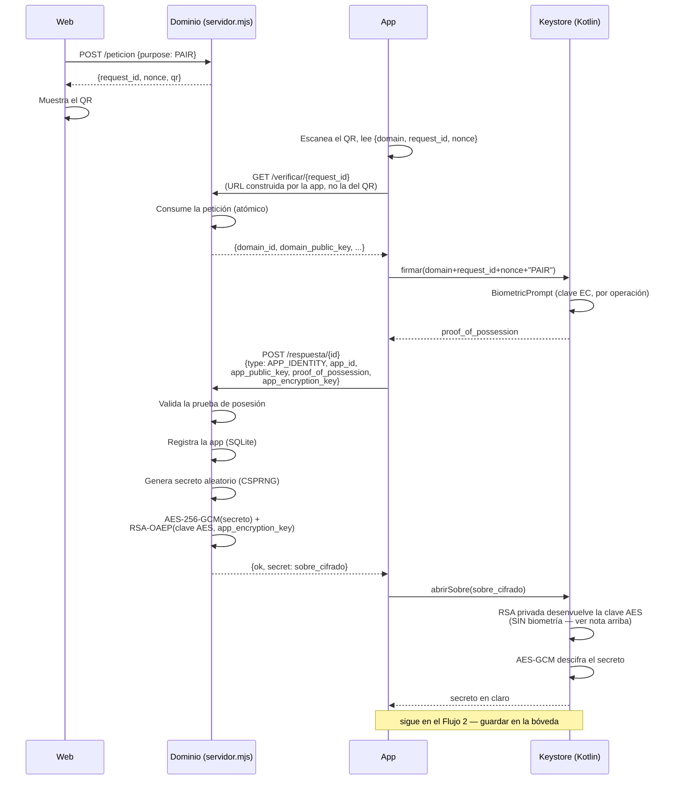
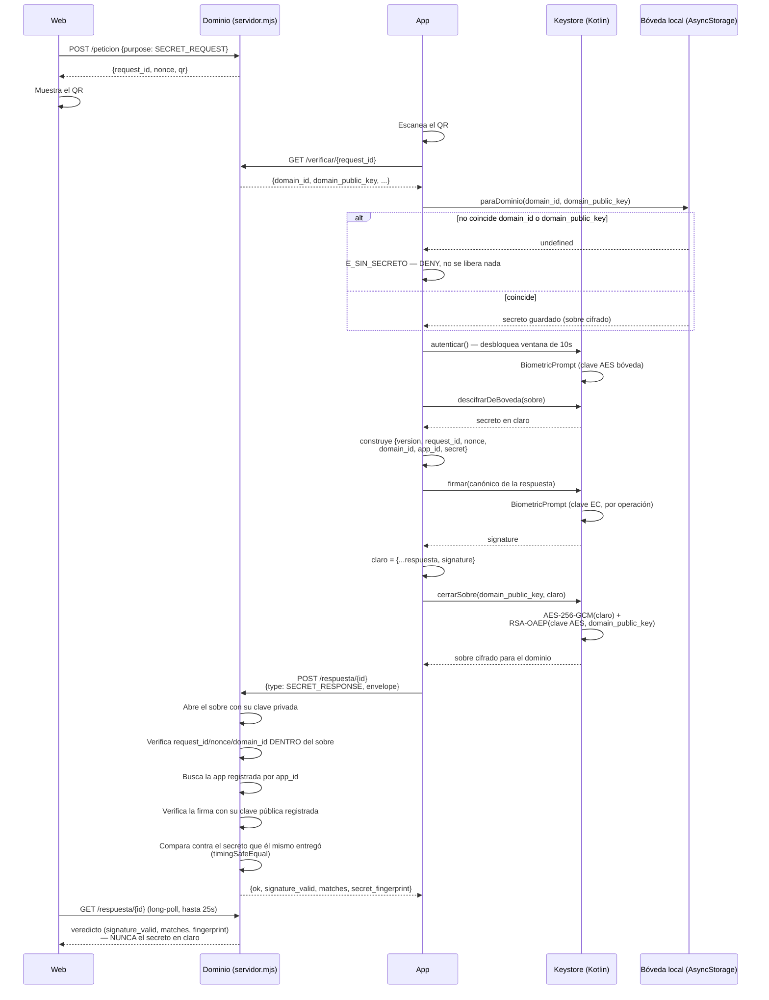
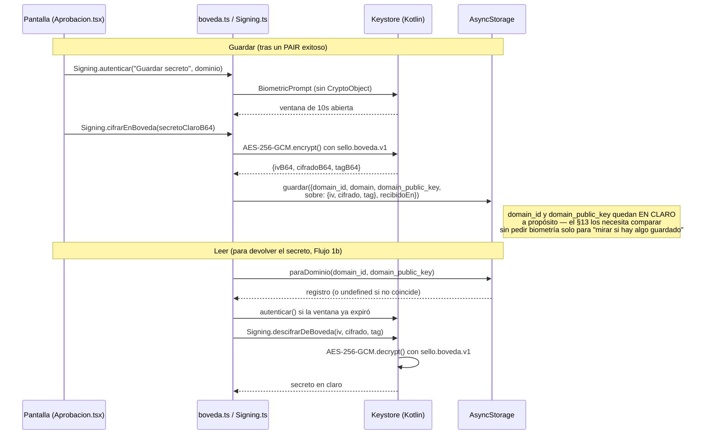

# Cómo funciona Sello — el código real

> Este documento describe lo que el código de este repositorio hace **de
> verdad**, no lo que pide `diseno_app.md`. Hay diferencias entre ambos —
> la más importante es que aquí no hay WebRTC: todo el transporte es HTTP
> normal (ver `server/README.md`, sección "Por qué esto es HTTP y no
> WebRTC"). Este documento no discute esas diferencias; solo explica cómo
> viaja y cómo se guarda el secreto en la implementación actual.

## Piezas

| Pieza | Archivo |
|---|---|
| Dominio de referencia | `server/servidor.mjs` |
| Demo web | `web/index.html` |
| Protocolo del lado app (JS) | `src/services/peticion.ts`, `src/services/boveda.ts` |
| Keystore nativo (Kotlin) | `android/app/src/main/java/io/sello/app/signing/SigningModule.kt` |

Tres claves viven en el Keystore de Android, cada una con su propio nivel
de protección:

La clave RSA es la única que **no** pide biometría al usarse — es una
decisión deliberada del código (un Keymaster concreto no completaba el
descifrado RSA-OAEP con clave ligada a autenticación); lo que autoriza
recibir un secreto nuevo es la firma de la prueba de posesión, hecha un
instante antes con la clave EC, que sí exige biometría.

---

## Flujo 1 — Cómo viaja el secreto

Tiene dos direcciones independientes: **el dominio lo entrega** al
emparejar, y **la app lo devuelve** cuando el dominio lo vuelve a pedir.

### 1a. Entrega inicial (emparejamiento, `purpose = PAIR`)

Puntos que vale la pena notar:

- La app **nunca** confía en una URL de verificación que venga en el QR:
  la construye ella misma a partir del campo `domain` (`baseDe()` en
  `peticion.ts`).
- El secreto viaja cifrado en todo momento; el navegador nunca lo ve, ni
  siquiera de paso — la Web solo recibe `secret_fingerprint` (huella
  SHA-256 truncada) como confirmación visual.
- La clave AES de sesión (para el sobre) es de un solo uso, generada al
  vuelo por el dominio; nunca se reutiliza entre peticiones.

### 1b. Devolución del secreto (recuperación, `purpose = SECRET_REQUEST`)

Puntos que vale la pena notar:

- El "domain match" (§13) se comprueba **dos veces**: por la app antes de
  leer la bóveda (`paraDominio`), y de forma implícita por el dominio al
  recibir la respuesta (compara `claro.domain_id` contra su propio
  `DOMAIN_ID`).
- El contexto (`request_id`, `nonce`, `domain_id`) va **firmado dentro
  del sobre cifrado**, no solo como parámetros de la URL — así el dominio
  no puede confiar en nada que no esté cubierto por la firma.
- La Web nunca recibe el secreto en claro, ni en el emparejamiento ni en
  la devolución: solo huellas (`secret_fingerprint`) y veredictos
  booleanos.

---

## Flujo 2 — Cómo se guarda el secreto (bóveda local)

El secreto que sale de `abrirSobre()` (Flujo 1a) **no se guarda tal
cual**: se vuelve a cifrar, esta vez con la clave AES de la bóveda —
distinta de la RSA que lo recibió — antes de tocar el disco.

Qué queda en claro y qué no, en el registro guardado
(`SecretoGuardado` en `boveda.ts`):

| Campo | ¿En claro? | Por qué |
|---|---|---|
| `domain_id` | Sí | El §13 necesita compararlo sin pedir autenticación solo para saber si hay algo guardado |
| `domain` (nombre) | Sí | Solo se usa para mostrarlo en pantalla, nunca para decidir nada |
| `domain_public_key` | Sí | Misma razón que `domain_id` — comparación de identidad, no un secreto |
| `sobre` (el secreto) | **No** | Cifrado con AES-256-GCM del Keystore; leerlo exige `autenticar()` |

Reglas de sustitución y borrado:

- Un secreto nuevo para la **misma** identidad de dominio (`domain_id`)
  **sustituye** al anterior — `boveda.guardar()` filtra los previos con
  ese `domain_id` antes de insertar el nuevo. No quedan dos secretos
  "vigentes" para el mismo dominio.
- `olvidarDominio(domainId)` borra solo el registro de ese dominio;
  `vaciarBoveda()` borra todo `AsyncStorage` bajo la clave
  `sello.boveda`.
- `borrarIdentidad()` (Kotlin) borra las tres claves del Keystore —
  irreversible, no hay copia en ningún lado.
